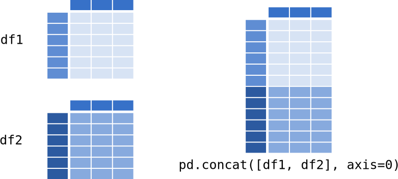

---
jupytext:
  formats: ipynb,md:myst
  text_representation:
    extension: .md
    format_name: myst
    format_version: 0.13
    jupytext_version: 1.15.2
kernelspec:
  display_name: Python 3 (ipykernel)
  language: python
  name: python3
---

<p><font size="6"><b>09 - Pandas: Combining datasets</b></font></p>


> *© 2023, Joris Van den Bossche and Stijn Van Hoey  (<mailto:jorisvandenbossche@gmail.com>, <mailto:stijnvanhoey@gmail.com>). Licensed under [CC BY 4.0 Creative Commons](http://creativecommons.org/licenses/by/4.0/)*

---

```{code-cell} ipython3
import pandas as pd
```

Combining data is essential functionality in a data analysis workflow. 

Data is distributed in multiple files, different information needs to be merged, new data is calculated, .. and needs to be added together. Pandas provides various facilities for easily combining together Series and DataFrame objects

```{code-cell} ipython3
# redefining the example objects

# series
population = pd.Series({'Germany': 81.3, 'Belgium': 11.3, 'France': 64.3, 
                        'United Kingdom': 64.9, 'Netherlands': 16.9})

# dataframe
data = {'country': ['Belgium', 'France', 'Germany', 'Netherlands', 'United Kingdom'],
        'population': [11.3, 64.3, 81.3, 16.9, 64.9],
        'area': [30510, 671308, 357050, 41526, 244820],
        'capital': ['Brussels', 'Paris', 'Berlin', 'Amsterdam', 'London']}
countries = pd.DataFrame(data)
countries
```

# Adding columns

+++

As we already have seen before, adding a single column is very easy:

```{code-cell} ipython3
pop_density = countries['population']*1e6 / countries['area']
```

```{code-cell} ipython3
pop_density
```

```{code-cell} ipython3
countries['pop_density'] = pop_density
```

```{code-cell} ipython3
countries
```

Adding multiple columns at once is also possible. For example, the following method gives us a DataFrame of two columns:

```{code-cell} ipython3
countries["country"].str.split(" ", expand=True)
```

We can add both at once to the dataframe:

```{code-cell} ipython3
countries[['first', 'last']] = countries["country"].str.split(" ", expand=True)
```

```{code-cell} ipython3
countries
```

# Concatenating data

+++

The ``pd.concat`` function does all of the heavy lifting of combining data in different ways.

``pd.concat`` takes a list or dict of Series/DataFrame objects and concatenates them in a certain direction (`axis`) with some configurable handling of “what to do with the other axes”.

+++

## Combining rows - ``pd.concat``

+++



+++

Assume we have some similar data as in `countries`, but for a set of different countries:

```{code-cell} ipython3
data = {'country': ['Belgium', 'France', 'Germany', 'Netherlands', 'United Kingdom'],
        'population': [11.3, 64.3, 81.3, 16.9, 64.9],
        'area': [30510, 671308, 357050, 41526, 244820],
        'capital': ['Brussels', 'Paris', 'Berlin', 'Amsterdam', 'London']}
countries = pd.DataFrame(data)
countries
```

```{code-cell} ipython3
data = {'country': ['Nigeria', 'Rwanda', 'Egypt', 'Morocco', ],
        'population': [182.2, 11.3, 94.3, 34.4],
        'area': [923768, 26338 , 1010408, 710850],
        'capital': ['Abuja', 'Kigali', 'Cairo', 'Rabat']}
countries_africa = pd.DataFrame(data)
countries_africa 
```

We now want to combine the rows of both datasets:

```{code-cell} ipython3
pd.concat([countries, countries_africa])
```

If we don't want the index to be preserved:

```{code-cell} ipython3
pd.concat([countries, countries_africa], ignore_index=True)
```

When the two dataframes don't have the same set of columns, by default missing values get introduced:

```{code-cell} ipython3
pd.concat([countries, countries_africa[['country', 'capital']]], ignore_index=True)
```

We can also pass a dictionary of objects instead of a list of objects. Now the keys of the dictionary are preserved as an additional index level:

```{code-cell} ipython3
pd.concat({'europe': countries, 'africa': countries_africa})
```

<div class="alert alert-info">

**NOTE**:

A typical use case of `concat` is when you create (or read) multiple DataFrame with a similar structure in a loop, and then want to combine this list of DataFrames into a single DataFrame.

For example, assume you have a folder of similar CSV files (eg the data per day) you want to read and combine, this would look like:

```python
import pathlib

data_files = pathlib.Path("data_directory").glob("*.csv")

dfs = []

for path in data_files:
    temp = pd.read_csv(path)
    dfs.append(temp)

df = pd.concat(dfs)
```
<br>
Important: append to a list (not DataFrame), and concat this list at the end after the loop!

</div>

+++

# Joining data with `pd.merge`

+++

Using `pd.concat` above, we combined datasets that had the same columns. But, another typical case is where you want to add information of a second dataframe to a first one based on one of the columns they have in common. That can be done with [`pd.merge`](http://pandas.pydata.org/pandas-docs/stable/generated/pandas.DataFrame.merge.html).

Let's look again at the titanic passenger data, but taking a small subset of it to make the example easier to grasp:

```{code-cell} ipython3
df = pd.read_csv("data/titanic.csv")
df = df.loc[:9, ['Survived', 'Pclass', 'Sex', 'Age', 'Fare', 'Embarked']]
```

```{code-cell} ipython3
df
```

Assume we have another dataframe with more information about the 'Embarked' locations:

```{code-cell} ipython3
locations = pd.DataFrame({'Embarked': ['S', 'C', 'N'],
                          'City': ['Southampton', 'Cherbourg', 'New York City'],
                          'Country': ['United Kindom', 'France', 'United States']})
```

```{code-cell} ipython3
locations
```

We now want to add those columns to the titanic dataframe, for which we can use `pd.merge`, specifying the column on which we want to merge the two datasets:

```{code-cell} ipython3
pd.merge(df, locations, on='Embarked', how='left')
```

In this case we use `how='left` (a "left join") because we wanted to keep the original rows of `df` and only add matching values from `locations` to it. Other options are 'inner', 'outer' and 'right' (see the [docs](http://pandas.pydata.org/pandas-docs/stable/merging.html#brief-primer-on-merge-methods-relational-algebra) for more on this, or this visualization: https://joins.spathon.com/).

+++

## Exercise with VAT numbers

For this exercise, we start from an open dataset on *"Enterprises subject to VAT"* (VAT = Value Added Tax), from https://statbel.fgov.be/en/open-data/enterprises-subject-vat-according-legal-form-11. For different regions and different enterprise types, it contains the number of enterprises subset to VAT ("MS_NUM_VAT"), and the number of such enterprises that started ("MS_NUM_VAT_START") or stopped ("MS_NUM_VAT_STOP") in 2019.

This file is provided as a zipped archive of a SQLite database file. Let's first unzip it:

```{code-cell} ipython3
import zipfile

with zipfile.ZipFile("data/TF_VAT_NACE_SQ_2019.zip", "r") as zip_ref:
    zip_ref.extractall()
```

SQLite (https://www.sqlite.org/index.html) is a light-weight database engine, and a database can be stored as a single file. With the `sqlite3` module of the Python standard library, we can open such a database and inspect it:

```{code-cell} ipython3
import sqlite3

# connect with the database file
con = sqlite3.connect("TF_VAT_NACE_2019.sqlite")
# list the tables that are present in the database
con.execute("SELECT name FROM sqlite_master WHERE type='table';").fetchall()
```

Pandas provides functionality to query data from a database. Let's fetch the main dataset contained in this file:

```{code-cell} ipython3
df = pd.read_sql("SELECT * FROM TF_VAT_NACE_2019", con)
df
```

More information about the identifyer variables (the first three columns) can be found in the other tables. For example, the "CD_LGL_PSN_VAT" column contains information about the legal form of the enterprise. What the values in this column mean, can be found in a different table:

```{code-cell} ipython3
df_legal_forms = pd.read_sql("SELECT * FROM TD_LGL_PSN_VAT", con)
df_legal_forms
```

This type of data organization is called a **"star schema"** (https://en.wikipedia.org/wiki/Star_schema), and if we want to get the a "denormalized" version of the main dataset (all the data combined), we need to join the different tables.

+++

<div class="alert alert-success">

**EXERCISE**:

Add the full name of the legal form (in the DataFrame `df_legal_forms`) to the main dataset (`df`). For this, join both datasets based on the "CD_LGL_PSN_VAT" column.
    
<details><summary>Hints</summary>

- `pd.merge` requires a left and a right DataFrame, the specification `on` to define the common index and the merge type `how`. 
- Decide which type of merge is most appropriate: left, right, inner,...

</details>      

</div>

```{code-cell} ipython3
:tags: [nbtutor-solution]

joined = pd.merge(df, df_legal_forms, on="CD_LGL_PSN_VAT", how="left")
joined
```

<div class="alert alert-success">

**EXERCISE**:

How many registered enterprises are there for each legal form? Sort the result from most to least occurring form.

<details><summary>Hints</summary>

- To count the number of registered enterprises, take the `sum` _for each_ (`groupby`) legal form.
- Check the `ascending` parameter of the `sort_values` function.

</details>    
    
</div>

```{code-cell} ipython3
:tags: [nbtutor-solution]

joined.groupby("TX_LGL_PSN_VAT_EN_LVL1")["MS_NUM_VAT"].sum().sort_values(ascending=False)
```

<div class="alert alert-success">

**EXERCISE**:

How many enterprises are registered per province?

* Read in the "TD_MUNTY_REFNIS" table from the database file into a `df_muni` dataframe, which contains more information about the municipality (and the province in which the municipality is located).
* Merge the information about the province into the main `df` dataset.
* Using the joined dataframe, calculate the total number of registered companies per province.

<details><summary>Hints</summary>

- Data loading in Pandas requires `pd.read_...`, in this case `read_sql`. Do not forget the connection object as a second input.
- `df_muni` contains a lot of columns, whereas we are only interested in the province information. Only use the relevant columns "TX_PROV_DESCR_EN" and "CD_REFNIS" (you need this to join the data).
- Calculate the `sum` _for each_ (`groupby`) province.    
    

</details>    
    
</div>

```{code-cell} ipython3
:tags: [nbtutor-solution]

df_muni = pd.read_sql("SELECT * FROM TD_MUNTY_REFNIS", con)
df_muni
```

```{code-cell} ipython3
:tags: [nbtutor-solution]

joined = pd.merge(df, df_muni[["CD_REFNIS", "TX_PROV_DESCR_EN"]], on="CD_REFNIS", how="left")
joined
```

```{code-cell} ipython3
:tags: [nbtutor-solution]

joined.groupby("TX_PROV_DESCR_EN")["MS_NUM_VAT"].sum()
```

## Joining with spatial data to make a map

The course materials contains a simplified version of the "statistical sectors" dataset (https://statbel.fgov.be/nl/open-data/statistische-sectoren-2019), with the borders of the municipalities. This dataset is provided as a zipped ESRI Shapefile, one of the often used file formats used in GIS for vector data.

The [GeoPandas](https://geopandas.org) package extends pandas with geospatial functionality.

```{code-cell} ipython3
import geopandas
import fiona
```

```{code-cell} ipython3
stat = geopandas.read_file("data/statbel_statistical_sectors_2019.shp.zip")
```

```{code-cell} ipython3
stat.head()
```

```{code-cell} ipython3
stat.plot()
```

The resulting dataframe (a `GeoDataFrame`) has a "geometry" column (in this case with polygons representing the borders of the municipalities), and a couple of new methods with geospatial functionality (for example, the `plot()` method by default makes a map). It is still a DataFrame, and everything we have learned about pandas can be used here as well.

Let's visualize the change in number of registered enterprises on a map at the municipality-level. 

We first calculate the total number of (existing/starting/stopping) enterprises per municipality:

```{code-cell} ipython3
df_by_muni = df.groupby("CD_REFNIS")[['MS_NUM_VAT', 'MS_NUM_VAT_START', 'MS_NUM_VAT_STOP']].sum()
```

And add a new column with the relative change in the number of registered enterprises:

```{code-cell} ipython3
df_by_muni["NUM_VAT_CHANGE"] = (df_by_muni["MS_NUM_VAT_START"] - df_by_muni["MS_NUM_VAT_STOP"]) / df_by_muni["MS_NUM_VAT"] * 100
```

```{code-cell} ipython3
df_by_muni
```

We can now merge the dataframe with the geospatial information of the municipalities with the dataframe with the enterprise numbers:

```{code-cell} ipython3
joined = pd.merge(stat, df_by_muni, left_on="CNIS5_2019", right_on="CD_REFNIS")
joined
```

With this joined dataframe, we can make a new map, now visualizing the change in number of registered enterprises ("NUM_VAT_CHANGE"):

```{code-cell} ipython3
joined["NUM_VAT_CHANGE_CAT"] = pd.cut(joined["NUM_VAT_CHANGE"], [-15, -6, -4, -2, 2, 4, 6, 15])
```

```{code-cell} ipython3
joined.plot(column="NUM_VAT_CHANGE_CAT", figsize=(10, 10), cmap="coolwarm", legend=True)#k=7, scheme="equal_interval")
```

## Combining columns  - ``pd.concat`` with ``axis=1``

+++

We can use `pd.merge` to combine the columns of two DataFrame based on a common column. If our two DataFrames already have equivalent rows, we can also achieve this basic case using `pd.concat` with specifying `axis=1` (or `axis="columns"`).

+++


+++

Assume we have another DataFrame for the same countries, but with some additional statistics:

```{code-cell} ipython3
data = {'country': ['Belgium', 'France', 'Germany', 'Netherlands', 'United Kingdom'],
        'population': [11.3, 64.3, 81.3, 16.9, 64.9],
        'area': [30510, 671308, 357050, 41526, 244820],
        'capital': ['Brussels', 'Paris', 'Berlin', 'Amsterdam', 'London']}
countries = pd.DataFrame(data)
countries
```

```{code-cell} ipython3
data = {'country': ['Belgium', 'France', 'Netherlands'],
        'GDP': [496477, 2650823, 820726],
        'area': [8.0, 9.9, 5.7]}
country_economics = pd.DataFrame(data).set_index('country')
country_economics
```

```{code-cell} ipython3
pd.concat([countries, country_economics], axis=1)
```

`pd.concat` matches the different objects based on the index:

```{code-cell} ipython3
countries2 = countries.set_index('country')
```

```{code-cell} ipython3
countries2
```

```{code-cell} ipython3
pd.concat([countries2, country_economics], axis="columns")
```
