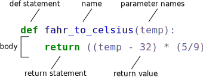

---
jupyter:
  jupytext:
    formats: ipynb,md
    text_representation:
      extension: .md
      format_name: markdown
      format_version: '1.3'
      jupytext_version: 1.16.1
  kernelspec:
    display_name: Python 3 (ipykernel)
    language: python
    name: python3
---

# Writing Functions

> *© 2021, Joris Van den Bossche and Stijn Van Hoey  (<mailto:jorisvandenbossche@gmail.com>, <mailto:stijnvanhoey@gmail.com>). Licensed under [CC BY 4.0 Creative Commons](http://creativecommons.org/licenses/by/4.0/)*

---

> This notebook is based on material of the [*Python Scientific Lecture Notes*](https://scipy-lectures.github.io/), the [*Software Carptentry: Programming with Python gapminder course*](https://swcarpentry.github.io/python-novice-gapminder) and the [*Software Carptentry: Programming with Python inflammation course*](https://swcarpentry.github.io/python-novice-inflammation/).

```python
import math
```

## Introduction


What if we want to convert some of our data, like taking a temperature in Fahrenheit and converting it to Celsius. We could write something like this for converting a single number:

```python
fahrenheit_val = 99
celsius_val = ((fahrenheit_val - 32) * (5/9))
```

and for a second number we could copy the same line and rename the variables

```python
fahrenheit_val2 = 43
celsius_val2 = ((fahrenheit_val2 - 32) * (5/9))
```

But we would be in trouble as soon as we had to do this more than a couple times. Cutting and pasting it is going to make our code get long and repetitive, very quickly. We'd like a way to package our code so that it is __easier to reuse__, a shorthand way of re-executing longer pieces of code. In Python we can use __functions__. 


## Function definition

Let’s start by defining a function `fahr_to_celsius` that converts temperatures from Fahrenheit to Celsius:

```python
def fahr_to_celsius(temperature):
    """Convert temperature in Fahrenheit to degrees Celsius"""
    return ((temperature - 32) * (5/9))
```

The function definition 

- opens with the keyword `def` 
- followed by the name of the function (`fahr_to_celsius`) and 
- a parenthesized list of parameter names (`temperature`) - empty parentheses if the function doesn’t take any inputs
- a colon to end the definition line
- the body of the function — the statements that are executed when it runs — is indented below the definition line 
- the body concludes with a `return` keyword followed by the return value. The return statement is optional, a function that doesn’t explicitly return a value automatically returns `None`.



When we call the function, the values we pass to it are assigned to those variables so that we can use them inside the function. Inside the function, we use a return statement to send a result back to whoever asked for it.

Let’s run our function. We call a function using round brackets `()`:

```python
fahr_to_celsius(32)
```

In fact, calling our own function is no different from calling any other function!

Functions allow us to encapsulate complexity so that we can treat it as a single "thing" and provides re-use by "writing one time, using many times". Each function is a small machine in our workflow.


The variable `temperature` only exists within the function itself. We call it a __local variable__ because they no longer exist once the function is done executing. If we try to access their values outside of the function, we will encounter an error:

```python
# temperature  # uncomment this cell
```

## Parameters


A function van have __mandatory parameters__ (positional arguments)

```python
def double_it(x):
    """Double a value"""
    return 2*x

double_it(3)
```

```python
#double_it()  # uncomment line
```

A function can also have __optional parameters__ (keyword or named arguments). Keyword arguments allow you to __specify default values__.

```python
def multiply_it(x, multiplication_factor=2):
    """Multiply a value"""    
    return x*multiplication_factor

print(multiply_it(3))
print(multiply_it(3, 3))
print(multiply_it(3, multiplication_factor=4))
```

The order of the keyword arguments (when specifying by name) does not matter, but it is good practice to use the same ordering as the function's definition. Keyword arguments 
are a very convenient feature for defining functions with a variable number of arguments, especially when default values are to be used in most calls to the function.


<div class="alert alert-danger">

__ALERT!__
  
Default values are evaluated when the function is defined, not when it is called. This can be problematic when using mutable types (e.g. dictionary or list) and modifying them in the function body, since the modifications will be persistent across invocations of the function.

Do not use lists of dictionaries as default arguments of a function!    
    
</div>


Using an mutable type in a keyword argument (and modifying it inside the function body)

```python
def add_to(xit=[]):
    xit.append(1)
    print(xit)

add_to()   # should return [1] 
add_to()   # should return [1]
add_to()   # should return [1]
```

### Variable number of parameters


Special forms of parameters:

* `*args`: any number of positional arguments packed into a tuple
* `**kwargs`: any number of keyword arguments packed into a dictionary

```python
def variable_args(*args, **kwargs):
    print('args is', args)
    print('kwargs is', kwargs)

variable_args('one', 'two', x=1, y=2, z=3)
```

## Docstrings


Document what a function does and its parameters to remind ourselves and our colleagues later what it’s for and how to use it.

A good overview is given in the [numpydoc formatting guidelines](https://numpydoc.readthedocs.io/en/latest/format.html) (other formatting styles that comply to the [Docstring Conventions](https://peps.python.org/pep-0257/) do exist as well, but numpy docstring format is the default within the scientific Python world). Make sure to provide a summary and parameters as a minimum.

```python
def funcname(param):
    """Concise one-line sentence describing the function.
    
    Extended summary which can contain multiple paragraphs.
    
    Parameters
    ----------
    param : type
        description of input parameter
    """
    # function body
    pass

funcname?
```

## Functions are objects


Functions are first-class objects, which means they can be:

* assigned to a variable
* an item in a list (or any collection)
* passed as an argument to another function.


```python
def double_it(x):
    """Double a value"""
    return 2*x

def half_it(x):
    """Divide a value by 2"""
    return x/2

dit = double_it
dit(5)
```

```python
def apply_it(x, func):
    return func(x)

apply_it(5, half_it), apply_it(5, double_it)
```

## Exercise


<div class="alert alert-success">

**EXERCISE**:
   
The **barometric formula**, sometimes called the exponential atmosphere or isothermal atmosphere, is a formula used to model how the **pressure** (or density) of the air **changes with altitude**. The pressure drops approximately by 11.3 Pa per meter in first 1000 meters above sea level.

$$P=P_0 \cdot \exp \left[\frac{-g \cdot M \cdot h}{R \cdot T}\right]$$
    
where:
* $T$ = standard temperature, 288.15 (K)
* $R$ = universal gas constant, 8.3144598, (J/mol/K)
* $g$ = gravitational acceleration, 9.81 (m/s$^2$)
* $M$ = molar mass of Earth's air, 0.02896 (kg/mol)

and:
* $P_0$ = sea level pressure (hPa)
* $h$ = height above sea level (m)    
    
The measured air pressure at sea level is 1010 hPa. Write a function `barometric_formula` with two input parameters:
    
- `pressure_sea_level`: a mandatory parameter.
- `height`: a keyword parameter with a default value of 2500.
    
Use the function `barometric_formula` to calculate the corresponding air pressure on 2500m and on 2750m above sea level when the measured air pressure at sea level is 1010 hPa.

<details><summary>Hints</summary>

- See notebook 02-functions_use.ipynb for the for the code itself, but encapsulate this into a function.
- Do not forget to add a docstring, see the specification on the [numpy docstring documentation](https://numpydoc.readthedocs.io/en/latest/format.html).

FYI, see https://www.math24.net/barometric-formula/ or https://en.wikipedia.org/wiki/Atmospheric_pressure    
    
</details>    
    
</div>

```python tags=["nbtutor-solution"]
import math

def barometric_formula(pressure_sea_level, height=2500):
    """Apply barometric formula
    
    Apply the barometric formula to calculate the air pressure on a given height
    
    Parameters
    ----------
    pressure_sea_level : float
        pressure, measured as sea level (hPa)
    height : float
        height above sea level (m)
    
    Notes
    ------
    see https://www.math24.net/barometric-formula/ or 
    https://en.wikipedia.org/wiki/Atmospheric_pressure
    """
    standard_temperature = 288.15
    gas_constant = 8.3144598
    gravit_acc = 9.81
    molar_mass_earth = 0.02896
    
    pressure_altitude = pressure_sea_level * math.exp(-gravit_acc * molar_mass_earth* height/(gas_constant*standard_temperature))
    return pressure_altitude

barometric_formula(1010), barometric_formula(1010, 2750)
```
