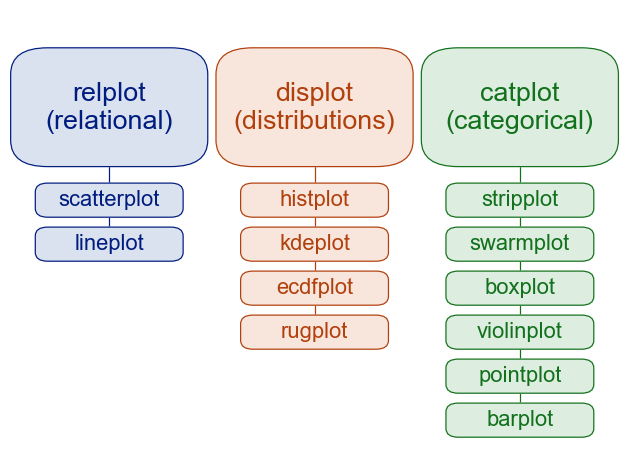

---
jupytext:
  formats: ipynb,md:myst
  text_representation:
    extension: .md
    format_name: myst
    format_version: 0.13
    jupytext_version: 1.16.6
kernelspec:
  display_name: Python 3 (ipykernel)
  language: python
  name: python3
---

<p><font size="6"><b>Visualisation: Seaborn </b></font></p>


> *© 2025, Joris Van den Bossche and Stijn Van Hoey  (<mailto:jorisvandenbossche@gmail.com>, <mailto:stijnvanhoey@gmail.com>). Licensed under [CC BY 4.0 Creative Commons](http://creativecommons.org/licenses/by/4.0/)*

---

```{code-cell} ipython3
import numpy as np
import pandas as pd
import matplotlib.pyplot as plt
```

# Seaborn

+++

[Seaborn](https://seaborn.pydata.org/) is a Python data visualization library:

* Built on top of Matplotlib, but providing
    1. High level functions.
    2. Support for _tidy data_, which became famous due to the `ggplot2` R package.
    3. Attractive and informative statistical graphics out of the box.
* Interacts well with Pandas

```{code-cell} ipython3
import seaborn as sns
```

## Introduction

+++

We will use the Titanic example data set:

```{code-cell} ipython3
titanic = pd.read_csv('data/titanic.csv')
```

```{code-cell} ipython3
titanic.head()
```

Let's consider following question:
>*For each class at the Titanic and each gender, what was the average age?*

+++

Hence, we should define the *mean* of the male and female groups of column `Survived` in combination with the groups of the `Pclass` column. In Pandas terminology:

```{code-cell} ipython3
age_stat = titanic.groupby(["Pclass", "Sex"])["Age"].mean().reset_index()
age_stat
```

Providing this data in a bar chart with pure Pandas is still partly supported:

```{code-cell} ipython3
age_stat.plot(kind='bar')
## A possible other way of plotting this could be using groupby again:   
#age_stat.groupby('Pclass').plot(x='Sex', y='Age', kind='bar') # (try yourself by uncommenting)
```

but with mixed results.

+++

__Seaborn__ provides another level of abstraction to visualize such *grouped* plots with different categories:

```{code-cell} ipython3
sns.catplot(data=age_stat, 
            x="Sex", y="Age", 
            col="Pclass", kind="bar")
```

Check <a href="#this_is_tidy">here</a> for a short recap about `tidy` data.

+++

<div class="alert alert-info">

**Remember**

- Seaborn is especially suitbale for these so-called <a href="http://vita.had.co.nz/papers/tidy-data.pdf">tidy</a> dataframe representations.
- The [Seaborn tutorial](https://seaborn.pydata.org/tutorial/data_structure.html#long-form-vs-wide-form-data) provides a very good introduction to tidy (also called _long-form_) data. 
- You can use __Pandas column names__ as input for the visualisation functions of Seaborn.

</div>

+++

## Interaction with Matplotlib

+++

Seaborn builds on top of Matplotlib/Pandas, adding an additional layer of convenience. 

Topic-wise, Seaborn provides three main modules, i.e. type of plots:

- __relational__: understanding how variables in a dataset relate to each other
- __distribution__: specialize in representing the distribution of datapoints
- __categorical__: visualize a relationship involving categorical data (i.e. plot something _for each category_)

The organization looks like this:

+++



+++

We first check out the top commands of each of the types of plots: `relplot`, `displot`, `catplot`, each returning a Matplotlib `Figure`:

+++

### Figure level functions

+++

Let's start from: _What is the relation between Age and Fare?_

```{code-cell} ipython3
# A relation between variables in a Pandas DataFrame -> `relplot`
sns.relplot(data=titanic, x="Age", y="Fare")
```

Extend to: _Is the relation between Age and Fare different for people how survived?_

```{code-cell} ipython3
sns.relplot(data=titanic, x="Age", y="Fare",
            hue="Survived")
```

Extend to: _Is the relation between Age and Fare different for people how survived and/or the gender of the passengers?_

```{code-cell} ipython3
age_fare = sns.relplot(data=titanic, x="Age", y="Fare",
                       hue="Survived",
                       col="Sex")
```

The function returns a Seaborn `FacetGrid`, which is related to a Matplotlib `Figure`:

```{code-cell} ipython3
type(age_fare), type(age_fare.fig)
```

As we are dealing here with 2 subplots, the `FacetGrid` consists of two Matplotlib `Axes`:

```{code-cell} ipython3
age_fare.axes, type(age_fare.axes.flatten()[0])
```

Hence, we can still apply all the power of Matplotlib, but start from the convenience of Seaborn.

+++

<div class="alert alert-info">

**Remember**

The `Figure` level Seaborn functions:    
    
- Support __faceting__ by data variables (split up in subplots using a categorical variable)
- Return a Matplotlib `Figure`, hence the output can NOT be part of a larger Matplotlib Figure

</div>

+++

### Axes level functions

+++

In 'technical' terms, when working with Seaborn functions, it is important to understand which level they operate, as `Axes-level` or `Figure-level`: 

- __axes-level__ functions plot data onto a single `matplotlib.pyplot.Axes` object and return the `Axes`
- __figure-level__ functions return a Seaborn object, `FacetGrid`, which is a `matplotlib.pyplot.Figure`

Remember the Matplotlib `Figure`, `axes` and `axis` anatomy explained in [visualization_01_matplotlib](visualization_01_matplotlib.ipynb)? 

Each plot module has a single `Figure`-level function (top command in the scheme), which offers a unitary interface to its various `Axes`-level functions (.

+++

We can ask the same question: _Is the relation between Age and Fare different for people how survived?_

```{code-cell} ipython3
scatter_out = sns.scatterplot(data=titanic, x="Age", y="Fare", hue="Survived")
```

```{code-cell} ipython3
type(scatter_out)
```

But we can't use the `col`/`row` options for facetting:

```{code-cell} ipython3
# sns.scatterplot(data=titanic, x="Age", y="Fare", hue="Survived", col="Sex")  # uncomment to check the output
```

We can use these functions to create custom combinations of plots:

```{code-cell} ipython3
fig, (ax0, ax1) = plt.subplots(1, 2, figsize=(10, 6))
sns.scatterplot(data=titanic, x="Age", y="Fare", hue="Survived", ax=ax0)
sns.violinplot(data=titanic, x="Survived", y="Fare", ax=ax1)  # boxplot, stripplot,.. as alternative to represent distribution per category
```

__Note!__ Check the similarity with the _best of both worlds_ approach:

1. Prepare with Matplotlib
2. Plot using Seaborn 
3. Further adjust specific elements with Matplotlib if needed

+++

<div class="alert alert-info">

**Remember**

The `Axes` level Seaborn functions:    
    
- Do NOT support faceting by data variables 
- Return a Matplotlib `Axes`, hence the output can be used in combination with other Matplotlib `Axes` in the same `Figure`

</div>

+++

## Exercises

+++

<div class="alert alert-success">

**EXERCISE**

- Make a histogram of the age, split up in two subplots by the `Sex` of the passengers.
- Put both subplots underneath each other. 
- Use the `height` and `aspect` arguments of the plot function to adjust the size of the figure.
    
<details><summary>Hints</summary>

- When interested in a histogram, i.e. the distribution of data, use the `displot` module
- A split into subplots is requested using a variable of the DataFrame (facetting), so use the `Figure`-level function instead of the `Axes` level functions.
- Link a column name to the `row` argument for splitting into subplots row-wise.

</details>

```{code-cell} ipython3
:tags: [nbtutor-solution]

sns.displot(data=titanic, x="Age", row="Sex", aspect=3, height=2)
```

<div class="alert alert-success">

**EXERCISE**

Make a violin plot showing the `Age` distribution in each of the `Pclass` categories comparing for `Sex`:
    
- Use the `Pclass` column to create a violin plot for each of the classes. To do so, link the `Pclass` column to the `x-axis`.
- Use a different color for the `Sex`.
- Check the behavior of the `split` argument and apply it to compare male/female.
- Use the `sns.despine` function to remove the boundaries around the plot.    
    
<details><summary>Hints</summary>

- Have a look at https://seaborn.pydata.org/examples/grouped_violinplots.html for inspiration.

</details>

```{code-cell} ipython3
:tags: [nbtutor-solution]

# Figure based
sns.catplot(data=titanic, x="Pclass", y="Age", 
            hue="Sex", split=True,
            palette="Set2", kind="violin")
sns.despine(left=True)
```

```{code-cell} ipython3
:tags: [nbtutor-solution]

# Axes based
sns.violinplot(data=titanic, x="Pclass", y="Age", 
               hue="Sex", split=True,
               palette="Set2")
sns.despine(left=True)
```

### Summary statistics

+++

Aggregations such as `count`, `mean` are embedded in Seaborn (similar to other 'Grammar of Graphics' packages such as ggplot in R and plotnine/altair in Python). We can do these operations directly on the original `titanic` data set in a single coding step:

```{code-cell} ipython3
sns.catplot(data=titanic, x="Survived", col="Pclass", 
            kind="count")
```

To use another statistical function to apply on each of the groups, use the `estimator`:

```{code-cell} ipython3
sns.catplot(data=titanic, x="Sex", y="Age", col="Pclass", kind="bar", 
            estimator=np.mean)
```

## Some more Seaborn functionalities to remember

+++

Whereas the `relplot`, `catplot` and `displot` represent the main components of the Seaborn library, more useful functions are available. You can check the [gallery](https://seaborn.pydata.org/examples/index.html) yourself, but let's introduce a few rof them:

+++

__jointplot()__ and __pairplot()__

`jointplot()` and `pairplot()` are Figure-level functions and create figures with specific subplots by default:

```{code-cell} ipython3
# joined distribution plot
sns.jointplot(data=titanic, x="Fare", y="Age", 
              hue="Sex", kind="scatter") # kde
```

```{code-cell} ipython3
sns.pairplot(data=titanic[["Age", "Fare", "Sex"]], hue="Sex")  # Also called scattermatrix plot
```

__heatmap()__

+++

Plot rectangular data as a color-encoded matrix.

```{code-cell} ipython3
titanic_age_summary = titanic.pivot_table(columns="Pclass", index="Sex", 
                                          values="Age", aggfunc="mean")
titanic_age_summary
```

```{code-cell} ipython3
sns.heatmap(data=titanic_age_summary, cmap="Reds")
```

__lmplot() regressions__

+++

`Figure` level function to generate a regression model fit across a FacetGrid:

```{code-cell} ipython3
g = sns.lmplot(
    data=titanic, x="Age", y="Fare", 
    hue="Survived", col="Survived",  # hue="Pclass"
)
```

# Exercises data set road casualties

+++

The [Belgian road casualties data set](https://statbel.fgov.be/en/themes/mobility/traffic/road-accidents) contains data about the number of victims involved in road accidents. 

The script `load_casualties.py` in the `data` folder contains the routine to download the individual years of data, clean up the data and concatenate the individual years. 

The `%run` is an ['IPython magic' ](https://ipython.readthedocs.io/en/stable/interactive/magics.html#magic-run) function to run a Python file as if you would run it from the command line. Run `%run ./data/load_casualties.py --help` to check the input arguments required to run the script. As data is available since 2005, we download 2005 till 2020.

__Note__ As the scripts downloads the individual files, it can take a while to run the script the first time.

```{code-cell} ipython3
# RUN THIS CELL TO PREPARE THE ROAD CASUALTIES DATA SET
%run ./data/load_casualties.py 2005 2020
```

When succesfull, the `casualties.csv` data is available in the `data` folder:

```{code-cell} ipython3
casualties = pd.read_csv("./data/casualties.csv", parse_dates=["datetime"])
```

The data contains the following columns (in bold the main columns used in the exercises):

- **datetime**: Date and time of the casualty.
- **week_day**: Weekday of the datetime.
- **n_victims**: Number of victims
- n_victims_ok: Number of victims without injuries
- n_slightly_injured: Number of slightly injured victims
- n_seriously_injured: Number of severely injured victims
- **n_dead_30days**: Number of victims that died within 30 days
- **road_user_type**: Road user type (passenger car, motorbike, bicycle, pedestrian, ...)
- victim_type: Type of victim (driver, passenger, ...)
- **gender**
- age
- **road_type**: Regional road, Motorway or Municipal road
- build_up_area: Outside  or inside built-up area
- **light_conditions**: Day or night (with or without road lights), or dawn
- refnis_municipality: Postal reference ID number of municipality
- municipality: Municipality name
- refnis_region: Postal reference ID number of region
- region: Flemish Region, Walloon Region or Brussels-Capital Region

Each row of the dataset does not represent a single accident, but a number of victims for a set of characteristics (for example, how many victims for accidents that happened between 8-9am at a certain day and at a certain road type in a certain municipality with the given age class and gender, ...). Thus, in practice, the victims of one accidents might be split over multiple rows (and one row might in theory also come from multiple accidents).  
Therefore, to get meaningful numbers in the exercises, we will each time _sum_ the number of victims for a certain aggregation level (a subset of those characteristics).

+++

<div class="alert alert-success">

**EXERCISE**

Create a barplot with the number of victims ("n_victims") for each hour of the day. Before plotting, calculate the total number of victims for each hour of the day with pandas and assign it to the variable `victims_hour_of_day`. Update the column names to respectively "Hour of the day" and "Number of victims".
    
Use the `height` and `aspect` to adjust the figure width/height.
    
<details><summary>Hints</summary>

- The sum of victims _for each_ hour of the day requires `groupby`. One can create a new column with the hour of the day or pass the hour directly to `groupby`.
- The groupby operation sets the key that you are grouping on as the index (row labels) of the result. The `reset_index()` method can be used to turn that index into normal dataframe columns.
- The `.dt` accessor provides access to all kinds of datetime information.
- `rename()` requires a dictionary with a mapping of the old to new names.
- A bar plot is in seaborn one of the `catplot()` options. 
    
</details>

```{code-cell} ipython3
:tags: [nbtutor-solution]

victims_hour_of_day = casualties.groupby(casualties["datetime"].dt.hour)["n_victims"].sum().reset_index()
victims_hour_of_day = victims_hour_of_day.rename(
    columns={"datetime": "Hour of the day", "n_victims": "Number of victims"}
)
```

```{code-cell} ipython3
:tags: [nbtutor-solution]

sns.catplot(data=victims_hour_of_day, 
            x="Hour of the day", 
            y="Number of victims", 
            kind="bar", 
            aspect=4,
            height=3,
)
```

<div class="alert alert-success">

**EXERCISE**

Create a barplot with the number of victims ("n_victims") for each hour of the day for each category in the gender column. Before plotting, calculate the total number of victims for each hour of the day and each gender with Pandas and assign it to the variable `victims_gender_hour_of_day`. 

Create a separate subplot for each gender category in a separate row.
    
Make sure to include the `NaN` values of the "gender" column as a separate subplot, called _"unknown"_ without changing the `casualties` DataFrame data.
    
<details><summary>Hints</summary>

- The sum of victims _for each_ hour of the day requires `groupby`. Groupby accepts multiple inputs to group on multiple categories together. 
- `groupby` also accepts a parameter `dropna=False` and/or using `fillna` is a useful function to replace the values in the gender column with the value "unknown".
- The `.dt` accessor provides access to all kinds of datetime information.
- Link the "gender" column with the `row`  parameter to create a facet of rows.
- Use the `height` and `aspect` to adjust the figure width/height.
    
</details>

```{code-cell} ipython3
:tags: [nbtutor-solution]

victims_gender_hour_of_day = casualties.groupby([casualties["datetime"].dt.hour, "gender"], 
                                                dropna=False)["n_victims"].sum().reset_index()
victims_gender_hour_of_day.head()
```

```{code-cell} ipython3
:tags: [nbtutor-solution]

sns.catplot(data=victims_gender_hour_of_day.fillna("unknown"),
            x="datetime", 
            y="n_victims", 
            row="gender",
            kind="bar", 
            aspect=4,
            height=3)
```

<div class="alert alert-success">

**EXERCISE**
    
Compare the number of victims for each day of the week for casualties that happened on a "Motorway" (`road_type` column) for trucks ("Truck" and "Light truck" in the `road_user_type` column).

Use a bar plot to compare the victims for each day of the week with Seaborn directly (do not use the `groupby`).
    
__Note__ The `week_day` is converted to an __ordered__ categorical variable. This ensures the days are sorted correctly in Seaborn.
    
<details><summary>Hints</summary>

- The first part of the exercise is filtering the data. Combine the statements with `&` and do not forget to provide the necessary brackets. The `.isin()`to create a boolean condition might be useful for the road user type selection. 
- Whereas using `groupby` to get to the counts is perfectly correct, using the `estimator` in Seaborn gives the same result.

__Note__ The `estimator=np.sum` is less performant than using pandas `groupby`. After filtering the data set, the summation with Seaborn is a feasible option.

</details>

```{code-cell} ipython3
# Convert weekday to Pandas categorical data type
casualties["week_day"] = pd.Categorical(
    casualties["week_day"],
    categories=["Monday", "Tuesday", "Wednesday",
                "Thursday", "Friday", "Saturday", "Sunday"],
    ordered=True
)
```

```{code-cell} ipython3
:tags: [nbtutor-solution]

casualties_motorway_trucks = casualties[
    (casualties["road_type"] == "Motorway")
    & casualties["road_user_type"].isin(["Light truck", "Truck"])
]
```

```{code-cell} ipython3
:tags: [nbtutor-solution]

sns.catplot(data=casualties_motorway_trucks,
            x="week_day",
            y="n_victims",
            estimator=np.sum,
            errorbar=None,
            kind="bar",
            color="#900C3F",
            height=3, 
            aspect=4)
```

<div class="alert alert-success">

**EXERCISE**
    
Compare the relative number of deaths within 30 days (in relation to the total number of victims) in between the following "road_user_type"s: "Bicycle", "Passenger car", "Pedestrian", "Motorbike" for the year 2019 and 2020:
    
- Filter the data for the years 2019 and 2020.
- Filter the data on the road user types "Bicycle", "Passenger car", "Pedestrian" and "Motorbike". Call the new variable `compare_dead_30`.
- Count for each combination of year and road_user_type the total victims and the total deaths within 30 days victims.
- Calculate the percentage deaths within 30 days (add a new column "dead_prop").
- Use a horizontal bar chart to plot the results with the "road_user_type" on the y-axis and a separate color for each year.
    
<details><summary>Hints</summary>

- By setting `datetime` as the index, slicing time series can be done using strings to filter data on the years 2019 and 2020. 
- Use `isin()` to filter "road_user_type" categories used in the exercise.
- Count _for each_... Indeed, use `groupby` with 2 inputs, "road_user_type" and the year of `datetime`.
- Deriving the year from the datetime: When having an index, use `compare_dead_30.index.year`, otherwise `compare_dead_30["datetime"].dt.year`.
- Dividing columns works element-wise in Pandas.
- A horizontal bar chart in seaborn is a matter of defining `x` and `y` inputs correctly. 

</details>

```{code-cell} ipython3
:tags: [nbtutor-solution]

# filter the data
compare_dead_30 = casualties.set_index("datetime")["2019":"2021"]
compare_dead_30 = compare_dead_30[compare_dead_30["road_user_type"].isin(
    ["Bicycle", "Passenger car", "Pedestrian", "Motorbike"])]

# Sum the victims and dead within 30 days victims for each year/road-user type combination
compare_dead_30 = compare_dead_30.groupby(
    ["road_user_type", compare_dead_30.index.year])[["n_dead_30days", "n_victims"]].sum().reset_index()

# create a new colum with the percentage deads
compare_dead_30["dead_prop"] = compare_dead_30["n_dead_30days"] / compare_dead_30["n_victims"] * 100
```

```{code-cell} ipython3
:tags: [nbtutor-solution]

sns.catplot(data=compare_dead_30,
            x="dead_prop",
            y="road_user_type",
            kind="bar",
            hue="datetime"
           )
```

<div class="alert alert-success">

**EXERCISE**
    
Create a line plot of the __monthly__ number of victims for each of the categories of victims ('n_victims_ok', 'n_dead_30days', 'n_slightly_injured' and 'n_seriously_injured') as a function of time:
    
- Create a new variable `monthly_victim_counts` that contains the monthly sum of 'n_victims_ok', 'n_dead_30days', 'n_slightly_injured' and 'n_seriously_injured'.
- Create a line plot of the `monthly_victim_counts` using Seaborn. Choose any [color palette](https://seaborn.pydata.org/tutorial/color_palettes.html).
- Create an `area` plot (line plot with the individual categories stacked on each other) using Pandas.

What happens with the data registration since 2012?
    
<details><summary>Hints</summary>

- Monthly statistics from a time series requires `resample` (with - in this case - `sum`), which also takes the `on` parameter to specify the datetime column (instead of using the index of the DataFrame). You can pick `ME` or `MS`.
- Apply the resampling on the `["n_victims_ok", "n_slightly_injured", "n_seriously_injured", "n_dead_30days"]` columns only.
- Seaborn line plots works without tidy data when NOT providing `x` and `y` argument. It also works using tidy data. To 'tidy' the data set, `.melt()` can be used, see [pandas_08_reshaping.ipynb](pandas_08_reshaping.ipynb).
- Pandas plot method works on the non-tidy data set with `plot.area()` .

__Note__ Seaborn does not have an area plot.

</details>

```{code-cell} ipython3
:tags: [nbtutor-solution]

monthly_victim_counts = casualties.resample("ME", on="datetime")[
    ["n_victims_ok", "n_slightly_injured", "n_seriously_injured", "n_dead_30days"]
].sum()
```

```{code-cell} ipython3
:tags: [nbtutor-solution]

sns.relplot(
    data=monthly_victim_counts,
    kind="line",
    palette="colorblind",
    height=3, aspect=4,
)
```

```{code-cell} ipython3
:tags: [nbtutor-solution]

# Optional solution with tidy data representation (providing x and y)
monthly_victim_counts_melt = monthly_victim_counts.reset_index().melt(
    id_vars="datetime", var_name="victim_type", value_name="count"
)

sns.relplot(
    data=monthly_victim_counts_melt,
    x="datetime", 
    y="count",
    hue="victim_type",
    kind="line",
    palette="colorblind",
    height=3, aspect=4,
)
```

```{code-cell} ipython3
:tags: [nbtutor-solution]

# Pandas area plot
monthly_victim_counts.plot.area(colormap='Reds', figsize=(15, 5))
```

<div class="alert alert-success">

**EXERCISE**
    
Make a line plot of the daily victims (column "n_victims") in 2020. Can you explain the counts from March till May?   
    
<details><summary>Hints</summary>

- To get the line plot of 2020 with daily counts, the data preparation steps are:
  - Filter data on 2020. By defining `datetime` as the index, slicing time series can be done using strings.
  - Resample to daily counts. Use `resample` with the sum on column "n_victims".
  - Create a line plot. Do you prefer Pandas or Seaborn?

</details>

```{code-cell} ipython3
:tags: [nbtutor-solution]

# Using Pandas
daily_total_counts_2020 = casualties.set_index("datetime")["2020":"2021"].resample("D")["n_victims"].sum()
daily_total_counts_2020.plot.line(figsize=(12, 3))
```

```{code-cell} ipython3
:tags: [nbtutor-solution]

# Using Seaborn
sns.relplot(data=daily_total_counts_2020,
            kind="line", 
            aspect=4, height=3)
```

<div class="alert alert-success">

**EXERCISE**
    
Combine the following two plots in a single Matplotlib figure:
    
- (left) The empirical cumulative distribution of the _weekly_ proportion of victims that died (`n_dead_30days` / `n_victims`) with a separate color for each "light_conditions".
- (right) The empirical cumulative distribution of the _weekly_ proportion of victims that died (`n_dead_30days` / `n_victims`) with a separate color for each "road_type".
    
Prepare the data for both plots separately with Pandas and use the variable `weekly_victim_dead_lc` and `weekly_victim_dead_rt`. 
    
<details><summary>Hints</summary>

- The plot can not be made by a single Seaborn Figure-level plot. Create a Matplotlib figure first and use the __axes__ based functions of Seaborn to plot the left and right Axes.
- The data for both subplots need to be prepared separately, by `groupby` once on "light_conditions" and once on "road_type".
- Weekly sums (`resample`) _for each_ (`groupby`) "light_conditions" or "road_type"?! yes! you need to combine both here.
- [`sns.ecdfplot`](https://seaborn.pydata.org/generated/seaborn.ecdfplot.html#seaborn.ecdfplot) creates empirical cumulative distribution plots.    

</details>

```{code-cell} ipython3
:tags: [nbtutor-solution]

# weekly proportion of deadly victims for each light condition
weekly_victim_dead_lc = (
    casualties
    .groupby("light_conditions")
    .resample("W", on="datetime")[["datetime", "n_victims", "n_dead_30days"]]
    .sum()
    .reset_index()
 )
weekly_victim_dead_lc["dead_prop"] = weekly_victim_dead_lc["n_dead_30days"] / weekly_victim_dead_lc["n_victims"] * 100

# .. and the same for each road type
weekly_victim_dead_rt = (
    casualties
    .groupby("road_type")
    .resample("W", on="datetime")[["datetime", "n_victims", "n_dead_30days"]]
    .sum()
    .reset_index()
)
weekly_victim_dead_rt["dead_prop"] = weekly_victim_dead_rt["n_dead_30days"] / weekly_victim_dead_rt["n_victims"] * 100
```

```{code-cell} ipython3
:tags: [nbtutor-solution]

fig, (ax0, ax1) = plt.subplots(1, 2, figsize=(15, 5))

sns.ecdfplot(data=weekly_victim_dead_lc, x="dead_prop", hue="light_conditions", ax=ax0)
sns.ecdfplot(data=weekly_victim_dead_rt, x="dead_prop", hue="road_type", ax=ax1)
```

<div class="alert alert-success">

**EXERCISE**
    
You wonder if there is a relation between the number of victims per day and the minimal daily temperature. A data set with minimal daily temperatures for the year 2020 is available in the `./data` subfolder: `daily_min_temperature_2020.csv`.
    
- Read the file `daily_min_temperature_2020.csv` and assign output to the variable `daily_min_temp_2020`.
- Combine the daily (minimal) temperatures with the `daily_total_counts_2020` variable
- Create a regression plot with Seaborn.
    
Does it make sense to present the data as a regression plot?
    
<details><summary>Hints</summary>

- `pd.read_csv` has a `parse_dates` parameter to load the `datetime` column as a Timestamp data type.
- `pd.merge` need a (common) key to link the data.
- `sns.lmplot` or `sns.jointplot` are both seaborn functions to create scatter plots with a regression. Joint plot adds the marginal distributions.

</details>

```{code-cell} ipython3
# available (see previous exercises)
daily_total_counts_2020 = casualties.set_index("datetime")["2020": "2021"].resample("D")["n_victims"].sum()
```

```{code-cell} ipython3
:tags: [nbtutor-solution]

daily_min_temp_2020 = pd.read_csv("./data/daily_min_temperature_2020.csv", 
                                  parse_dates=["datetime"])
```

```{code-cell} ipython3
:tags: [nbtutor-solution]

daily_with_temp = daily_total_counts_2020.reset_index().merge(daily_min_temp_2020, on="datetime")
```

```{code-cell} ipython3
:tags: [nbtutor-solution]

g = sns.jointplot(
    data=daily_with_temp, x="air_temperature", y="n_victims", kind="reg"
)
```

# Need more Seaborn inspiration?

+++

<div class="alert alert-info" style="font-size:18px">

__Remember__

[Seaborn gallery](https://seaborn.pydata.org/examples/index.html) and package [documentation](https://seaborn.pydata.org/index.html)

</div>

+++

<a id='this_is_tidy'></a>

+++

# Recap: what is `tidy`?

+++

If you're wondering what *tidy* data representations are, you can read the scientific paper by Hadley Wickham, http://vita.had.co.nz/papers/tidy-data.pdf. 

Here, we just introduce the main principle very briefly:

+++

Compare:

#### un-tidy
        
| WWTP | Treatment A | Treatment B |
|:------|-------------|-------------|
| Destelbergen | 8.  | 6.3 |
| Landegem | 7.5  | 5.2 |
| Dendermonde | 8.3  | 6.2 |
| Eeklo | 6.5  | 7.2 |

*versus*

#### tidy

| WWTP | Treatment | pH |
|:------|:-------------:|:-------------:|
| Destelbergen | A  | 8. |
| Landegem | A  | 7.5 |
| Dendermonde | A  | 8.3 |
| Eeklo | A  | 6.5 |
| Destelbergen | B  | 6.3 |
| Landegem | B  | 5.2 |
| Dendermonde | B  | 6.2 |
| Eeklo | B  | 7.2 |

+++

This is sometimes also referred as *short* versus *long* format for a specific variable... Seaborn (and other grammar of graphics libraries) work better on `tidy` (long format) data, as it better supports `groupby`-like transactions!

+++

<div class="alert alert-info" style="font-size:16px">

**Remember:**

A tidy data set is setup as follows:
 
- Each <code>variable</code> forms a <b>column</b> and contains <code>values</code>
- Each <code>observation</code> forms a <b>row</b>
- Each type of <code>observational unit</code> forms a <b>table</b>.

</div>

```{code-cell} ipython3

```
